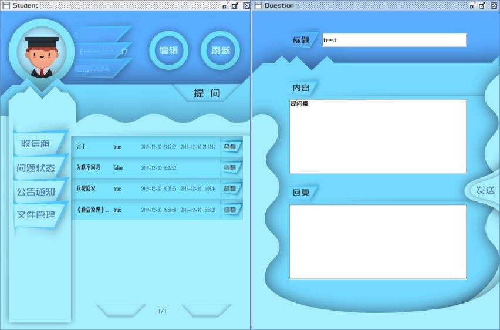

# 项目概要
该项目是软件课程设计作品，题目为“**学生信息管理系统**”。  
该项目使用`Java`以及`MySQL`语言实现，使用的软件及版本为`IntelliJ IDEA 2019.2.3`、`MySQL workbench 8.0 CE`和`Photoshop CC 2018`。  
该项目分别针对学生、老师、管理员实现了下列功能：
- 老师和学生 注册、登录、忘记密码、管理个人信息功能；
- 老师和学生 上传/下载文件功能；
- 学生提问 以及老师回答问题功能；
- 老师 管理学生信息、定时发布公告功能；
- 管理员 管理所有人信息、提醒老师及时回答问题、统计答疑率功能。

---
# 成员分工
- ### **高占恒**  
我本人主要负责前端部分，包括UI代码编写以及UI样式设计。   

- ### **汤渴昕**  
汤大佬主要负责后端部分，包括数据库搭建以及后台信息处理。   

---
# 代码结构

---
# 成果展示
- ### **登录界面**

- ### **学生界面**

- ### **老师界面**

